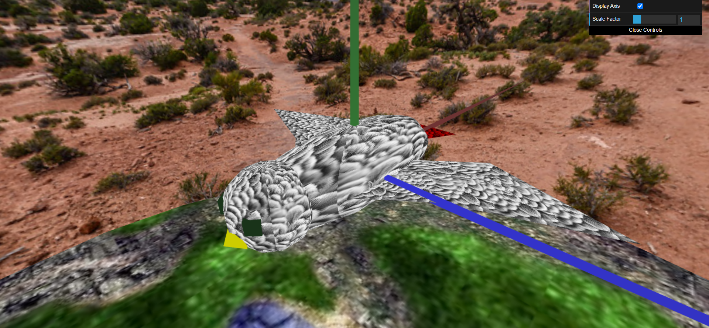

# CG 2022/2023
## Group T10G01
## Project Notes

During the first steps of the project we learned how to build a sphere and later, how to invert it, so we can use it as a skybox, to simulate being in a real environment.

Afterwards we modelled our bird "Gaspar", based on an african gray parrot, using various geometric shapes.

