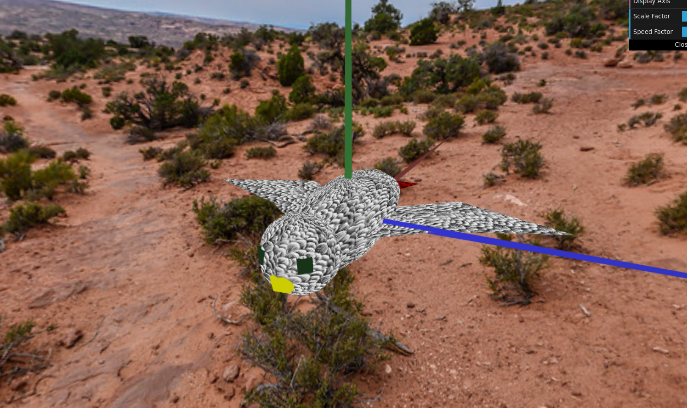

# CG 2022/2023
## Group T10G01
## Project Notes

During the first steps of the project we learned how to build a sphere and later, how to invert it, so we can use it as a skybox, to simulate being in a real environment.

Afterwards we modelled our bird "Gaspar", based on an african gray parrot, using various geometric shapes.

Then we added terrain, and with shaders we added elevation to using a heightmap and with an altimetry shifted the colors

At this point we modelled eggs, modifying the code used for the sphere, the nest using a circumference and cylinders.
During this phase we also implemented egg catching/droping and nest interractions.

We then implemented tree billboards using shaders to remove the excess from the image and using math we made it so the trees follow the camera´s horizontal movements.

