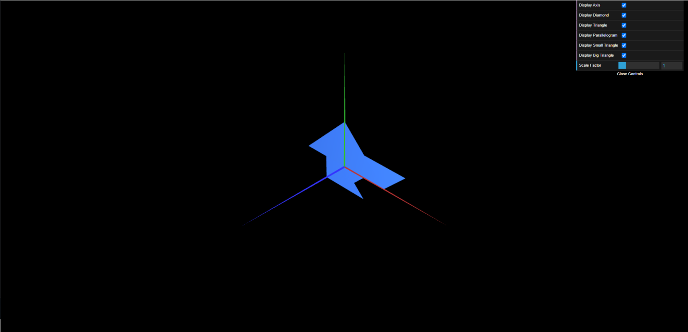

# CG 2022/2023

## Group T10G01

## TP 1 Notes

- In exercise 1 we observed that objects only show from 1 side, unless explcity drawn from both sides
- In exercise 2 we put in pratice the things we learned in ex 2

