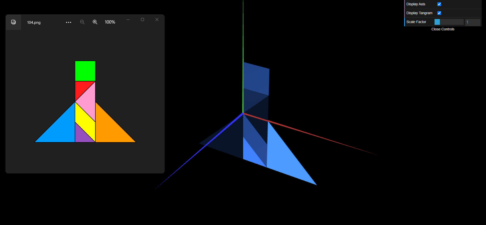
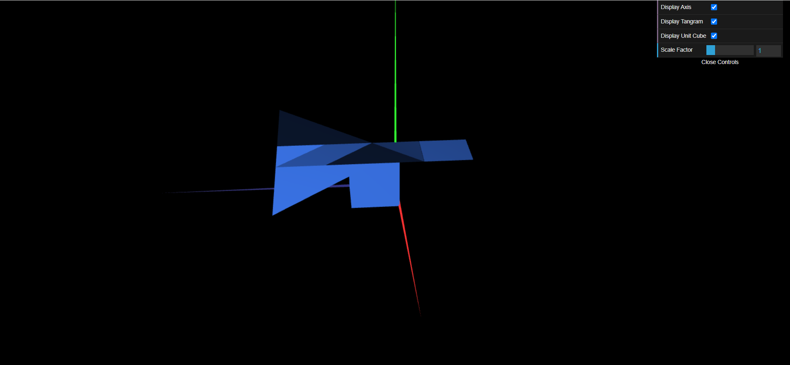
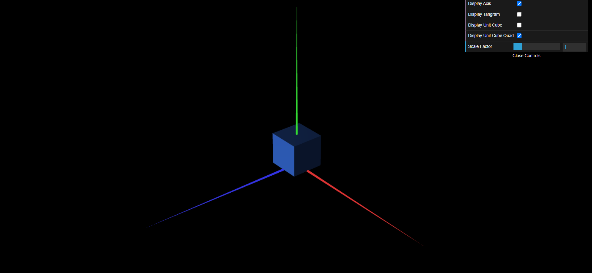

# CG 2022/2023

## Group T10G01

## TP 2 Notes

- In exercise 1 we learned how to apply the 3 transformations on to simple objects.
- This exercise was more difficult than we expected, and the transformations can seem confusing, especially because the 3 axis aren't ordered how we are used to.

- In exercise 2 we put in pratice the things we learned in exercise 1 and we learned how to create a cube.

- In exercise 3 we learned how to build a cube, but now with various elements instead of drawing triangles.

