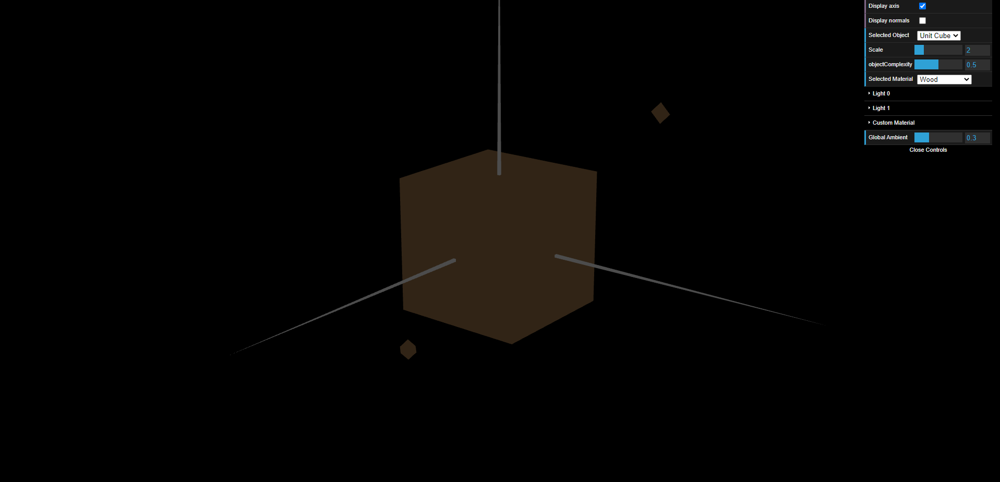
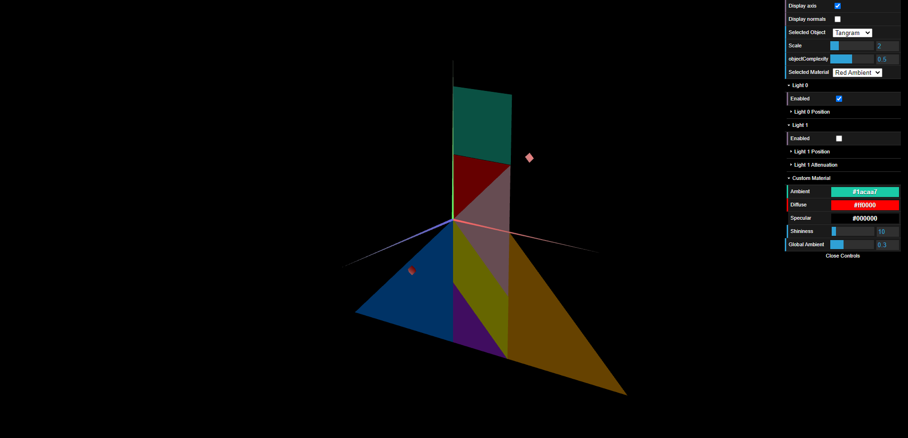
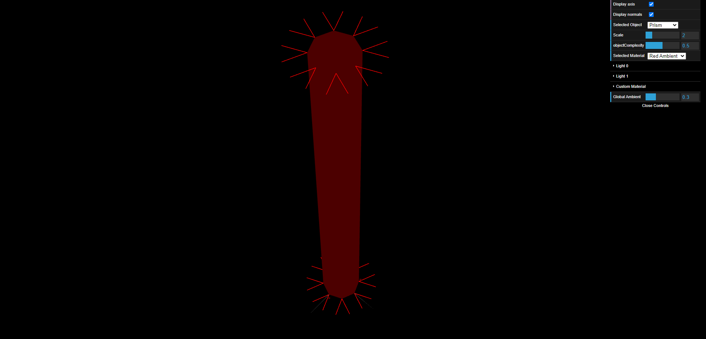
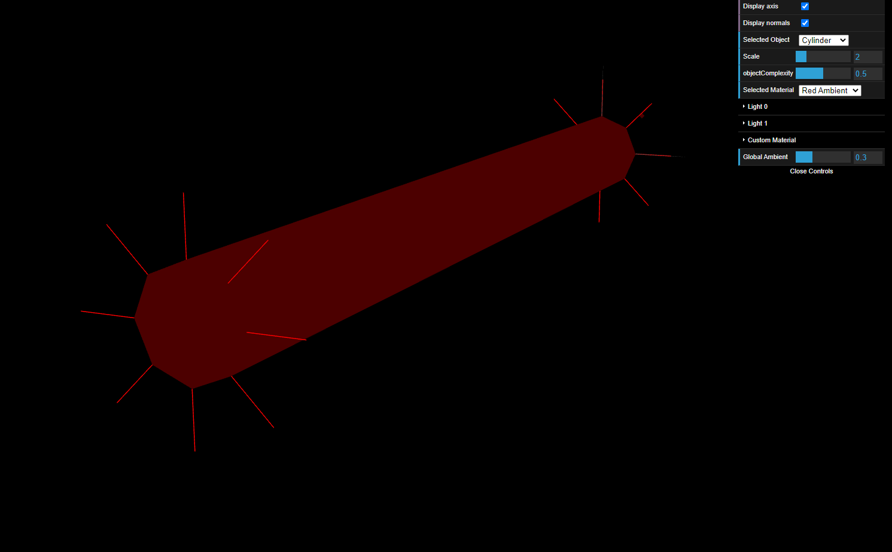

# CG 2022/2023
## Group T10G01
## TP 3 Notes

- During the experiments we learned how to use the different types of lights and their effects on objects

- During the first half of the first exercise, we learned how to create normal vectors and how to create our own material

- During the second half of the first exercise, we applied the different colours to each tangram piece, applying what we learned in the first half

- Because of each face sharing one normal vector with its neighbour, the lighting has an effect similar to constant shading

- Now, with reduced duplicate vertices and with only one normal vector, lighting makes the cylinder appear much smoother than previously seen on the prism