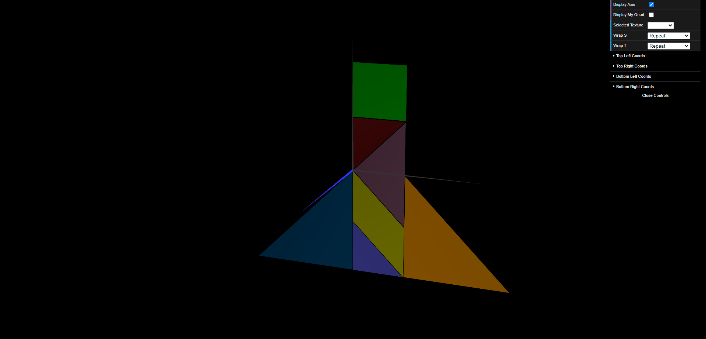
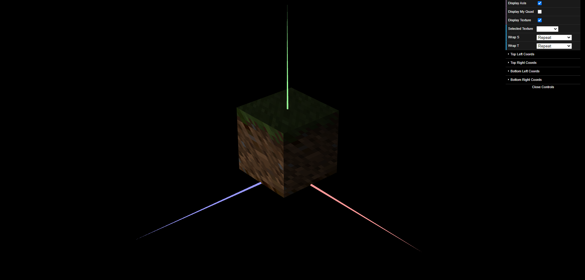

# CG 2022/2023
## Group T10G01
## TP 4 Notes

- During the experiments we experimented with some different textures and wrap modes/ coordinate manipulation

- During the first exercise we mapped the tangram texture image to each of the tangram´s pieces

- During the second exercise we loaded different textures into the unit cube, and used a texture filtering method to make them look sharper
