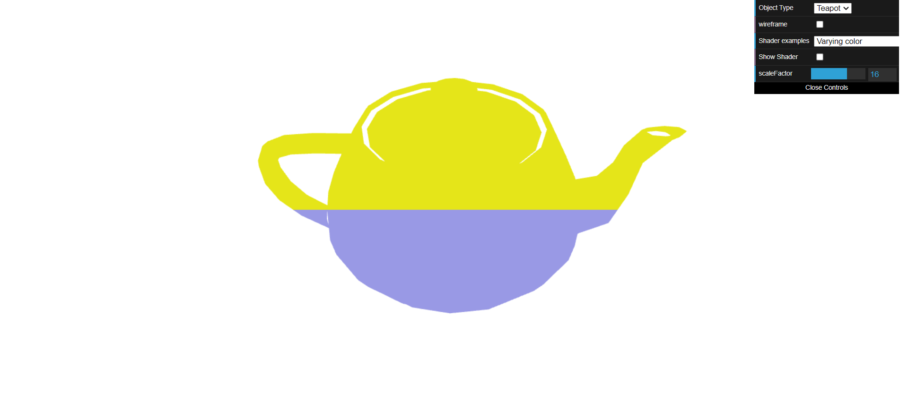
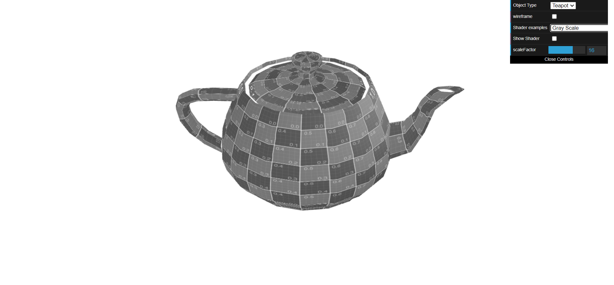
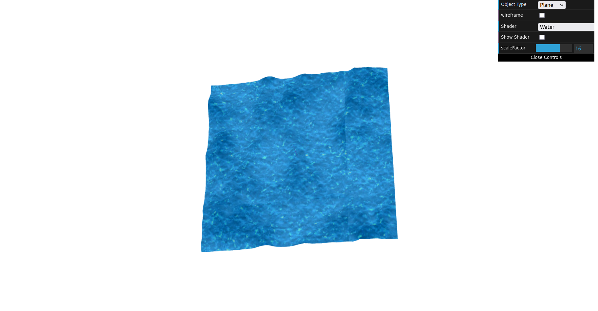

# CG 2022/2023
## Group T10G01
## TP 5 Notes

- During this first half of this class, we learned the basics of shaders, and passing of arguments

- For the second half, we created more complex shaders, and learned how to apply a basic height map.

